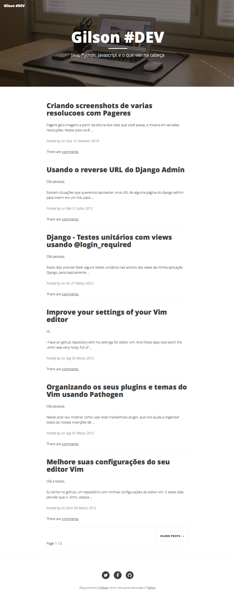

# Pelican Clean Blog Theme

Theme based in [Clean Blog layout](http://ironsummitmedia.github.io/startbootstrap-clean-blog/).

## Screenshot



## Basic configuration

All configurations about this theme.

### Header Covers

To define custom header cover, set the property ``HEADER_COVER`` in ``pelicanconf.py``:

```python
HEADER_COVER = 'static/my_image.png'
```

### Social URLs

Github, Twitter and Facebook URLs set these properties:

```python
GITHUB_URL = 'http://github.com/myprofile'
TWITTER_URL = 'http://twitter.com/myprofile'
FACEBOOK_URL = 'http://facebook.com/myprofile'
```

If you have insert new links, customize ``base.html``.

### Code highlights

This theme contains this color schemes:

 - Tomorrow - ``tomorrow.css``;
 - Tomorrow Night - ``tomorrow_night.css``;
 - Monokai - ``monokai.css``;
 - Github - ``github.css``;
 - Darkly (Default) - ``darkly.css``;

To customize, define ``COLOR_SCHEME_CSS`` in ``pelicanconf.py`` with css filename. Example:

```python
COLOR_SCHEME_CSS = 'monokai.css'
```

### Analytics

Accept many analytics:

 - Google Analytics: ``GOOGLE_ANALYTICS``;
 - Gauges: ``GAUGES`` 
 - Piwik: ``PIWIK_URL`` and ``PIWIK_SITE_ID``.

### Articles

To customize header cover to articles, insert the metadata ``header_cover``:

 - To RST
```rst
My super title
##############

:date: 2010-10-03 10:20
:modified: 2010-10-04 18:40
:tags: thats, awesome
:category: yeah
:slug: my-super-post
:authors: Alexis Metaireau, Conan Doyle
:summary: Short version for index and feeds
:header_cover: /images/posts/super-title/cover.png
```

 - To Markdown
```markdown
Title: My super title
Date: 2010-12-03 10:20
Modified: 2010-12-05 19:30
Category: Python
Tags: pelican, publishing
Slug: my-super-post
Authors: Alexis Metaireau, Conan Doyle
Summary: Short version for index and feeds
Header_Cover: /images/posts/super-title/cover.png

This is the content of my super blog post.
```

Other metada was created to assign resume of article, with ``headline``:

 - To RST
```rst
My super title
##############

:date: 2010-10-03 10:20
:modified: 2010-10-04 18:40
:tags: thats, awesome
:category: yeah
:slug: my-super-post
:authors: Alexis Metaireau, Conan Doyle
:summary: Short version for index and feeds
:headline: Resume of article
```

 - To Markdown
```markdown
Title: My super title
Date: 2010-12-03 10:20
Modified: 2010-12-05 19:30
Category: Python
Tags: pelican, publishing
Slug: my-super-post
Authors: Alexis Metaireau, Conan Doyle
Summary: Short version for index and feeds
Headline: Resume of article

This is the content of my super blog post.
```

